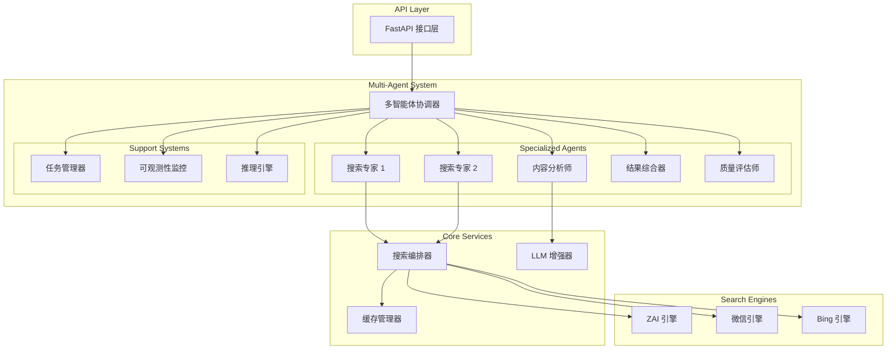

# 多智能体搜索系统架构

## 🎯 系统概述

E-WebSearch 多智能体搜索系统是一个基于协作智能体的分布式搜索架构，通过多个专门化智能体的协同工作，实现高效、智能的网络搜索和内容分析。

## 🏗️ 架构设计

### 整体架构图



## 🤖 智能体系统

### 智能体类型

#### 1. 搜索专家 (Search Specialist)
- **职责**: 执行搜索任务，选择最优搜索策略
- **能力**: 
  - 多源并行搜索
  - 智能策略选择
  - 搜索性能优化
  - 结果初步筛选
- **思考过程**:
  - 分析查询复杂度
  - 选择搜索源组合
  - 评估搜索策略效果
  - 优化搜索参数

#### 2. 内容分析师 (Content Analyzer)
- **职责**: 分析和增强搜索结果内容
- **能力**:
  - 内容语义理解
  - LLM 驱动的摘要生成
  - 关键标签提取
  - 内容质量评估
- **思考过程**:
  - 评估内容完整性
  - 生成语义摘要
  - 提取关键信息
  - 标注内容特征

#### 3. 结果综合器 (Result Synthesizer)
- **职责**: 整合多源搜索结果
- **能力**:
  - 结果去重和合并
  - 多维度排序
  - 结果聚类分析
  - 多样性保证
- **思考过程**:
  - 识别重复内容
  - 计算综合相关性
  - 平衡结果多样性
  - 优化结果排序

#### 4. 质量评估师 (Quality Assessor)
- **职责**: 评估最终结果质量
- **能力**:
  - 多维度质量评估
  - 相关性打分
  - 可信度分析
  - 时效性评估
- **思考过程**:
  - 评估信息准确性
  - 计算相关性分数
  - 分析来源可信度
  - 评估内容时效性

### 协调机制

#### 多智能体协调器 (Multi-Agent Coordinator)
- **核心功能**:
  - 任务分解和分配
  - 智能体间通信协调
  - 执行流程管理
  - 结果聚合和响应

- **协调策略**:
  - **并行执行**: 多个搜索专家同时工作
  - **流水线处理**: 搜索→分析→综合→评估
  - **动态调度**: 根据负载和性能动态分配任务
  - **故障恢复**: 智能体故障时的任务重分配

## 🧠 思考过程和可观测性

### 决策记录系统
每个智能体都记录详细的决策过程：

```python
{
    "timestamp": 1703123456.789,
    "type": "strategy_selection",
    "context": {
        "query": "用户查询",
        "available_sources": ["zai", "wechat", "bing"],
        "current_load": 0.3
    },
    "reasoning": [
        "分析查询复杂度为中等",
        "选择多源并行搜索策略",
        "预期执行时间2-3秒"
    ],
    "outcome": "parallel_search_strategy"
}
```

### 评估记录系统
智能体对任务和结果进行多维度评估：

```python
{
    "timestamp": 1703123456.789,
    "target": "search_results",
    "criteria": {
        "relevance": 0.85,
        "completeness": 0.92,
        "diversity": 0.78
    },
    "result": 0.85,
    "notes": ["结果质量良好", "覆盖面广泛"]
}
```

### 交互记录系统
记录智能体间的协作过程：

```python
{
    "timestamp": 1703123456.789,
    "type": "task_handoff",
    "with_agent": "content_analyzer",
    "content": {
        "task_id": "analysis_task_123",
        "data_size": 1024,
        "priority": "high"
    },
    "result": "accepted"
}
```

## 🔄 执行流程

### 标准搜索流程

1. **请求接收**
   - API 层接收搜索请求
   - 协调器解析请求参数
   - 创建执行会话

2. **任务分解**
   - 分析查询复杂度
   - 确定执行策略（并行/串行）
   - 创建子任务

3. **并行搜索**
   - 多个搜索专家并行工作
   - 每个专家选择最优搜索策略
   - 执行多源搜索

4. **内容分析**
   - 内容分析师接收搜索结果
   - 使用 LLM 生成摘要和标签
   - 提取关键信息

5. **结果综合**
   - 结果综合器整合所有结果
   - 去重和排序
   - 保证结果多样性

6. **质量评估**
   - 质量评估师评估最终结果
   - 计算质量和相关性分数
   - 生成评估报告

7. **响应构建**
   - 协调器收集所有智能体的工作成果
   - 构建完整的响应对象
   - 包含思考过程和性能指标

### 自适应优化

- **策略学习**: 基于历史执行效果优化搜索策略
- **负载均衡**: 动态调整任务分配以优化性能
- **质量反馈**: 根据结果质量调整评估标准
- **资源管理**: 智能管理计算和网络资源

## 📊 性能监控

### 系统级指标
- 总体响应时间
- 任务成功率
- 并行效率
- 资源利用率

### 智能体级指标
- 个体任务完成时间
- 决策质量评分
- 协作效率
- 学习进度

### 业务级指标
- 搜索结果质量
- 用户满意度
- 缓存命中率
- 成本效益比

## 🚀 扩展性设计

### 水平扩展
- 支持动态增加智能体实例
- 负载自动分配和均衡
- 跨节点协调机制

### 功能扩展
- 插件化智能体架构
- 自定义推理引擎
- 可配置的协调策略

### 集成扩展
- 支持新的搜索引擎
- 集成更多 LLM 服务
- 外部系统接口

## 🔒 安全和可靠性

### 容错机制
- 智能体故障检测和恢复
- 任务重试和降级策略
- 数据一致性保证

### 安全措施
- 请求验证和限流
- 敏感信息过滤
- 访问控制和审计

### 监控告警
- 实时性能监控
- 异常检测和告警
- 自动化运维支持
